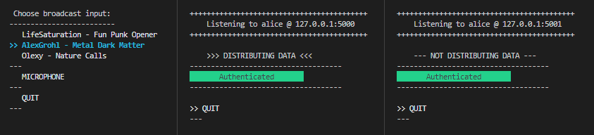

# AudiBro

> This software is a part of the Master thesis of *Frantisek Mejzlik* titled **Fast hash-based signing protocol for message stream authentication**.

**Audi**o **Bro**adcaster is an example application for real-time audio broadcasting. It demonstrates the usage of the [HAB crate](https://gitlab.mff.cuni.cz/mejzlikf/hab) for post-quantum data stream authentication based on hash-based signatures in a real-world scenario.

## **Prerequisites**

* **Operating system**: The crate **should** work fine on common modern Linux distributions, Windows NT systems and MacOS. Though, it was explicitly tested with Debian 11 and Windows 10/11.
* [**Rust compiler**](https://www.rust-lang.org/learn/get-started): Version 1.58 or higher.
* **Dependencies**:
  * On Linux, [`alsa`](https://wiki.debian.org/ALSA) lib is required; for example, on Debian it is installed with the package `libasound2`

```sh
sudo apt update
sudo apt libasound2-dev
 ```

> Not all other used third-party crates may be written in pure Rust and may depend on some libraries (standard shared object libraries) that must be installed in the system. These are usually easy to install using the system package manager (`apt`, `yum`, ...). If so, the compiler will let you know what library is missing.

## **Compile**

```sh
# A debug build
cargo build
# A release build
cargo build --release
```

## **Running**

 It is recommended to have three terminal windows where you can run a sender (Alice), a receiver + distributor (Bob) and a receiver (Carol). In the `scripts` directory, there are convenience scripts that will get your radio setup running in no time. Feel free to inspect and play with the different arguments by inspecting those scripts.

Each of the actors will run in separate environment directory inside `env` --- i.e. `sender-alice`, `receiver-bob` and `receiver-carol`. The broadcast topology would look like this:


To run the setup, execute each of the following commands in your prepared terminal windows.

```sh
# An original sender Alice (broadcasting on the port 5000)
./scripts/run-tui-sender-alice.sh
# A receiver and distributor Bob (broadcasting on the port 5001)
./scripts/run-tui-receiver-bob-from-alice.sh
# A receiver Carol
./scripts/run-tui-receiver-carol-from-bob.sh
```

Having done that, you should see a UI in the sender terminal.



Navigate through options using the arrow keys and start streaming the selected MP3 file or input from your default input device by hitting ENTER. You can change the input as you wish by selecting a different input. The receivers should start receiving messages with the audio data and play that to you via your default audio output device. In their terminal windows, you can monitor the authentication status of the received messages — i.e. if you are listening to authenticated data or not

## **Advanced usage**

This example also offers other modes of operation; for example, the non-TUI mode, where you can send ASCII messages by typing them into the STDIN of a sender process and hitting ENTER. In case you want to know more, please refer to [this page](docs/ADVANCED.md).

## **Logging**

To monitor the AudiBro application, a special logging mechanism is categorized into different log files that can be monitored in real-time. To read more about that, please head to [this page](docs/LOGGING.md).

## **Documentation**

The user documentation is available in the appendix of the thesis. The developer documentation can be generated and displayed by running the following command. The documentation will be built and shown in your default browser.

```sh
cargo doc --open
```

## **Known limitations**

Since this is only an example application, it is not production ready; it is merely an example of how to use the HAB crate. Know limitations are listed [HERE](docs/LIMITATIONS.md).

## **License**

Copyright © 2023 Frantisek Mejzlik <frankmejzlik@proton.me>

Permission is hereby granted, free of charge, to any person obtaining a copy of this software and associated documentation files (the “Software”), to deal in the Software without restriction, including without limitation the rights to use, copy, modify, merge, publish, distribute, sublicense, and/or sell copies of the Software, and to permit persons to whom the Software is furnished to do so, subject to the following conditions:

The above copyright notice and this permission notice shall be included in all copies or substantial portions of the Software.

THE SOFTWARE IS PROVIDED “AS IS”, WITHOUT WARRANTY OF ANY KIND, EXPRESS OR IMPLIED, INCLUDING BUT NOT LIMITED TO THE WARRANTIES OF MERCHANTABILITY, FITNESS FOR A PARTICULAR PURPOSE AND NONINFRINGEMENT. IN NO EVENT SHALL THE AUTHORS OR COPYRIGHT HOLDERS BE LIABLE FOR ANY CLAIM, DAMAGES OR OTHER LIABILITY, WHETHER IN AN ACTION OF CONTRACT, TORT OR OTHERWISE, ARISING FROM, OUT OF OR IN CONNECTION WITH THE SOFTWARE OR THE USE OR OTHER DEALINGS IN THE SOFTWARE.
